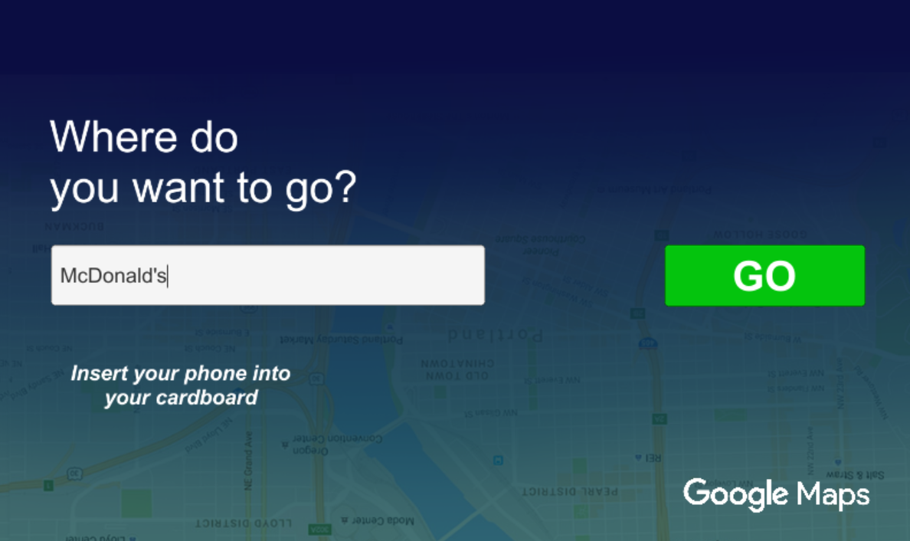
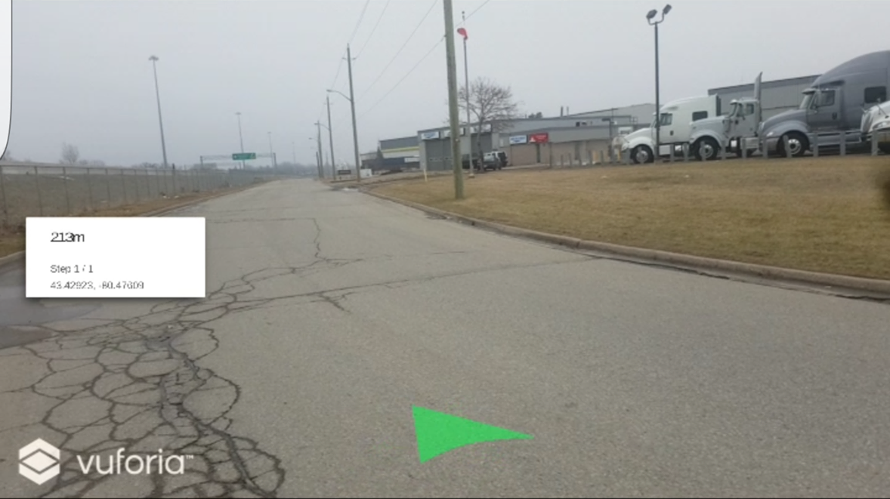

# Google-Maps-AR
*Developed during WearHacks Waterloo*  
An android augmented reality application, which provides navigation directions and real-time position tracking viewable with and without AR headsets.  
You can enter a location, the directions will be displayed step-by-step on the camera's video feed, with a pointer to the next step.
A few screenshots are shown below (sorry for the bad quality, I blame the screen recorder):

Notes:
* the main folder is called "Shoot the cubes" because, being a hackathon project, it started off as a very different thing and we were too lazy to change the name
* might have some permission issues accessing the phone's built-in compass, causing it to crash
